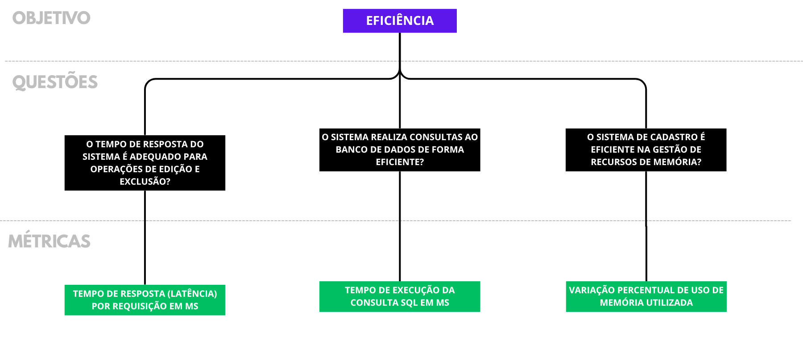

# **Plano de Medição**

## **Objetivo de Medição 1**

| **Analisar** | AgroMart |
| --- | --- |
| **Para o propósito de** | Avaliar |
| **Com respeito a** | Usabilidade |
| **Do ponto de vista do/a** | Usuário Consumidor (Co-Agricultor) |
| **No contexto de** | Qualidade de Software 1 |

**Questões**

**Q1.** Os usuários consumidores compreendem as mensagens do sistema durante o processo de aquisição de um produto no AgroMart?

- **Hipótese Q1.** 90% das mensagens de erro possíveis descrevem de forma coerente o real motivo do erro, no mínimo.

**Q2.** A linguagem da mensagem está adequada ao público-alvo (sem termos técnicos)?

- **Hipótese Q2.** Pelo menos 90% das mensagens de erro não mencionam termos relacionados ao funcionamento interno do sistema.

**Q3.** A documentação da AgroMart oferece ajuda para qualquer tipo de operação no software?

- **Hipótese Q3.** Pelo menos 90% das funcionalidades da AgroMart estão na documentação, tendo a descrição de como utilizá-lo.

| **Campo**                           | **Descrição**                                                                                                                                       |
|------------------------------------|-----------------------------------------------------------------------------------------------------------------------------------------------------|
| **Objeto**                         | Proteção contra erros do usuário                                                                                                                    |
| **Propósito**                      | Avaliar                                                                                                                                             |
| **Foco da Qualidade**              | Usabilidade                                                                                                                                         |
| **Ponto de Vista**                 | Usuário consumidor (Co-Produtor)                                                                                                                    |
| **Foco de Qualidade**              |         Usabilidade                                                                                                                         |
| **Fatores de Variação**                    | - Clareza da mensagem do erro ocorrido    - Visibilidade de status do sistema                                                                   |
| **Hipóteses de Baseline**          | Distribuição pela clareza das informações:   - 90% das mensagens de erro possíveis descrevem de forma coerente o real motivo do erro, no mínimo.   - Pelo menos 90% das mensagens de erro não mencionam termos relacionados ao funcionamento interno do sistema.   - Pelo menos 90% das funcionalidades da AgroMart estão na documentação, tendo a descrição de como utilizá-lo.                                                                                                                   |
| **Impacto nas hipóteses de baseline** | Consequências da má disposição de informações:   Caso a disposição de informações do AgroMart não seja acessível ou não apresentem uma linguagem compreensível, afetará em:   - Capacidade de identificar o motivo da falha;   - Compreensão de como corrigir a falha;   - Capacidade de consultar instruções previamente elaboradas. |

## **Métricas Selecionadas:**

1. **Completude de Descrição de Mensagens**
    - **Descrição:**
        - Pertence à métrica de Usabilidade e seu objetivo é determinar a taxa de funcionalidades que apresentam uma resposta que, de fato, guie o usuário a uma solução em casos de erros.
    - **Elementos de Medição da Qualidade:**
        - A = Número de Funções que descrevem corretamente os erros do software;
        - B = Número Total de Funções
    - **Foco da Medição:** Externo/Interno
2. **Completude da Documentação do Usuário e Facilidade de Uso**
    - **Descrição:**
        - Pertence à métrica de Usabilidade e seu objetivo é determinar quantas funcionalidades a documentação ensina ao usuário em como utilizar.
    - **Elementos de Medição da Qualidade:**
        - A = Número de Funcionalidades descritas na documentação;
        - B = Número de Funcionalidades totais.
    - **Foco da Qualidade:** Externo/Interno.
3. **Clareza de Mensagens**
    - **Descrição:**
        - Pertence à métrica de Usabilidade, e seu objetivo é descrever quantas mensagens do sistema são de fácil entendimento.
    - **Elementos de Medição da Qualidade:**
        - A = Número de mensagens que são fáceis de entender;
        - B = Número total de mensagens.
    - **Foco da Qualidade:**
        - Externo/Interno.

### **Objetivo de medição 2**

| **Analisar** | AgroMart |
| --- | --- |
| **Para o propósito de** | Avaliar |
| **Com respeito a** | Eficiência |
| **Do ponto de vista do/a** | Usuário Produtor (Agricultor) |
| **No contexto de** | Qualidade Software 1 |

**Q1.** O tempo de resposta do sistema é adequado para operações de edição e exclusão?

- **Hipótese Q1.** 80% das requisições tiveram um tempo de resposta inferior a 100ms.

**Q2.** O sistema realiza consultas ao banco de dados de forma eficiente?

- **Hipótese Q2.** 95% de todas as consultas disponíveis são retornadas em até 150ms.

**Q3.** O sistema de cadastro é eficiente na gestão de recursos de memória?

**Hipótese Q3.**

O uso médio da memória RAM utilizada permanece com variação inferior a 10% ao tratar uma requisição.

# Abstraction sheet do Objetivo de Medição 2

| **Campo**               | **Descrição**                                         |
|------------------------|-------------------------------------------------------|
| **Objeto**             | Interface Web do Produtor                             |
| **Propósito**          | Avaliar                                               |
| **Foco da Qualidade**  | Eficiência                                            |
| **Ponto de Vista**     | Usuário Produtor (Agricultor)                         |

---

| **Foco de Qualidade** | **Fatores de Variação**                                |
|------------------------|--------------------------------------------------------|
| Eficiência             | - Uso de recursos de hardware   - Velocidade de processamento do sistema |

---

| **Hipóteses de _Baseline_** | **Impacto nas hipóteses de _baseline_** |
|-----------------------------|------------------------------------------|
| - Distribuição pela assertividade em ações no sistema:   &nbsp;&nbsp;• 80% das requisições tiveram um tempo de resposta inferior a 100ms.   &nbsp;&nbsp;• 95% de todas as consultas disponíveis são retornadas em até 150ms.   &nbsp;&nbsp;• O uso médio da memória RAM utilizada permanece com variação inferior a 10% ao tratar uma requisição. | - Se o sistema não for eficiente em uso de infraestrutura e for lento, pode ocasionar em:   &nbsp;&nbsp;• Frustração por parte do produtor ao executar operações simples de consulta, edição, exclusão ou inclusão;   &nbsp;&nbsp;• Falha catastrófica causadora de morte do processo da aplicação; |

## **Métricas Selecionadas:**

1. **Tempo de resposta (latência) por requisição em ms**
    - **Descrição:**
        - Pertence à métrica de Eficiência e seu objetivo é determinar o tempo de resposta por requisição em milissegundos.
    - **Elementos de Medição da Qualidade:**
        - T = Tempo de execução em milissegundos (ms)
    - **Foco da Medição:** Externo/Interno.
2. **Tempo de execução da consulta SQL em ms**
    - **Descrição:**
        - Pertence à métrica de Eficiência e seu objetivo é determinar o tempo decorrido durante uma consulta feita ao banco de dados pelo usuário através do sistema.
    - **Elementos de Medição da Qualidade:**
        - T = Tempo de execução em milissegundos (ms)
    - **Foco da Qualidade:** Externo/Interno.
3. **Variação percentual de uso de memória utilizada**
    - **Descrição:**
        - Pertence à métrica de Eficiência, e seu objetivo é determinar a variação no uso de memória RAM pelo sistema ao processar uma requisição.
    - **Elementos de Medição da Qualidade:**
        - M₁ = Memória utilizada antes (em MB)
        - M₂ = Memória utilizada depois (em MB)
        - ΔM% = ((M₂ - M₁) / M₁) * 100
    - **Foco da Qualidade:** Externo/Interno.

**Relação entre Objetivos, Questões e Métricas**

## **Contribuições**

| **Matrícula** | **Nome** | **Atividade realizada** | **% de contribuição** |
| --- | --- | --- | --- |
| 211061583 | Daniel Rodrigues da Rocha | Desenvolvimento dos Objetivos, Questões, diagramas e parcialmente o abstraction sheet |  |
| 221031149 | Danilo César Tertuliano Melo | Atualização nas métricas do objetivo 2; aplicação de formatação |  |
| 211041221 | Luan Mateus Cesar Duarte | Elaboração parcial dos fatores de qualidade, fatores de variação e impacto nas hipóteses de baseline do abstraction sheet |  |
| 200062620 | Pedro Augusto Dourado Izarias | Elaboração parcial das questões, hipóteses, métricas e atualização do diagrama relacionado |  |
| 211029540 | Pedro Sena Barbosa Holtz Yen | Elaboração parcial das questões, hipóteses e métricas das medições de Usabilidade e Eficiência |  |
| 211031860 | Victório Lázaro Rocha de Morais | Adição da questão 4 do objetivo 1 e sua hipótese; edição da imagem do objetivo 1 |  |