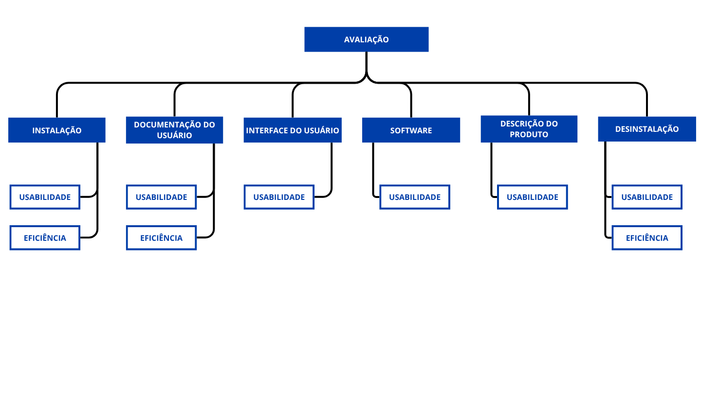

Versão 2.0

# Processo de Avaliação do Produto

## Sobre o Produto:
Informações detalhadas podem ser consultadas na seção [Sobre o AgroMart](../01-agromart/sobre.md). No Tópico abaixo, serão descritos informações técnicas e pertinentes ao processo de avaliação.

- **Nome do Software:** AgroMart
- **Versão do Produto:** Não especificado. Considera-se a versão disponível em Abril de 2025
- **Domínio da Aplicação do Produto:** Software comercial, pois foi desenvolvido para ajudar agricultores a se comunicarem com os seus co-agricultores.

### Descrição Geral do Produto:

#### Funções das Quais o Produto é  Composto:
Cadastro e Autenticação de Usuários, Cadastro e Gerenciamento de Produtos, Visualização de Produtos disponíveis, Processamento de Pedidos e Vendas, dentre outras.

#### Quais são as principais Tarefas do Produto?
Permitir que agricultores cadastrem e gerenciem seus produtos agroecológicos, Facilitar a busca e aquição de produtos pelos consumidores e Gerenciar pedidos e tran sações comerciais.

#### Quem sã os principais usuários do produto?
Agricultores familiares e pequenos produtores, consumidores interessados em produtos agroecológicos e cooperativas e organizações de apoio à agricultura familiar.

### Como é o ambiente no qual o produto será inserido?
A plataforma é acessível via navegador e dispositivos móveis, considerando diferentes níveis de infraestrutura. Exige conhecimento intermediário em informática, pois envolve cadastro e vendas sem instruções guiadas. No domínio agrícola, requer conhecimento avançado, já que é voltada especificamente para este setor.

### Massa de Dados:
É esperado que haja dados de exemplos no Backend da plataforma, como Seeds ou Mockups de entrada em testes Unitários para endpoints.

## Objetivo da Avaliação:
O objetivo da Equipe Radia Perlman após o fim do processo de avaliação é apontar melhorias na interface do software AgroMart.

## Aspectos da Qualidade a serem avaliados (Com ênfase atribuída de 1 à 5):

| **Aspecto da Qualidade** | **Ênfase**           |
|--------------------------|----------------------|
| Usabilidade              | 5 - Grande Interesse |
| Eficiência               | 5 - Grande Interesse   |
| Funcionalidade           | 4 - Largo Interesse  |
| Confiabilidade           | 4 - Largo Interesse  |
| Completitude             | 3 - Médio Interesse  |
| Portabilidade            | 2 - Baixo Interesse  |

## Requisitos para a Execução da Avaliação:

- Utilização de um dispositivo computacional não móvel:
    - Desktop;
    - Notebook.
- Navegador Chrome, Edge ou Firefox atualizados com a versão igual ou superior à data de Abril de 2025;
- Instalação do Pacote NodeJs na versão 18+ (Na versão 18 ou mais);
- PostgreSQL ou Conexão com um banco Relacional em Núvem, como Heroku.

## Classificação da ODS do Produto:

### 2) Erradicar a Fome:
O AgroMart contribui diretamente para a ODS 2 ao fortalecer a agricultura familiar e facilitar o acesso da população a alimentos frescos e locais. Ao conectar produtores rurais diretamente aos consumidores finais por meio de uma plataforma digital, o AgroMart colabora para garantir sistemas alimentares sustentáveis, promovendo o escoamento da produção de pequenos agricultores que, muitas vezes, enfrentam dificuldades para competir com grandes redes de distribuição. Essa aproximação também permite preços mais justos e maior diversidade alimentar nas cidades, ajudando a combater a insegurança alimentar de forma prática e inclusiva.

### 9) Indústria, Inovação e Infraestruturas:
O AgroMart representa inovação tecnológica voltada para o campo e para cadeias de produção alternativas. Por ser um sistema digital que conecta produtores e consumidores, ele exemplifica como soluções baseadas em software podem modernizar o setor agropecuário, mesmo em escalas menores. A plataforma atua como uma infraestrutura digital de apoio à produção rural, incentivando a digitalização do campo, a inclusão tecnológica de agricultores e a construção de redes logísticas locais mais inteligentes. Isso promove inovação social e tecnológica, especialmente em comunidades que tradicionalmente têm menos acesso a essas ferramentas.

### 12) Produção e Consumo Sustentáveis:
A proposta do AgroMart está alinhada com o conceito de consumo consciente e produção responsável. Ao facilitar circuitos curtos de comercialização — como os modelos de Comunidades que Sustentam a Agricultura (CSA) — a plataforma reduz o desperdício, diminui a necessidade de transporte em longas distâncias (diminuindo a emissão de carbono) e promove a valorização de práticas agroecológicas. Para os consumidores, há um estímulo a escolhas alimentares mais saudáveis e locais; para os produtores, um incentivo à produção em menor escala, mas com maior valor agregado e menor impacto ambiental. Isso contribui para uma cadeia alimentar mais sustentável.

## Modelo de Qualidade:

---
**Histórico de Versões**

| **Versão** | **Data**     | **Descrição**                     | **Autor**                                     |
|------------|--------------|-----------------------------------|-----------------------------------------------|
| `1.0`      | 02/06/2025   | Criação e estruturação da página  | [Luan Mateus](https://github.com/luanduartee) |
| `2.0`      | 05/06/2025   | Recriação do Tópico               | [DanielRogs](https://github.com/DanielRogs)   |

