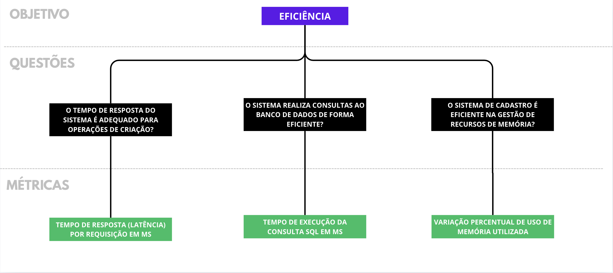

Versão 1.0

# Detalhamento do Plano de Medição:

## Abstraction sheet do Objetivo de Medição 1

<table>
  <tr>
    <th>Objeto</th>
    <th>Propósito</th>
    <th>Foco da Qualidade</th>
    <th>Ponto de Vista</th>
  </tr>
  <tr>
    <td>Proteção contra erros do usuário</td>
    <td>Avaliar</td>
    <td>Usabilidade</td>
    <td>Usuário consumidor (Co-Produtor)</td>
  </tr>
  <tr>
    <th colspan="2">Foco da Qualidade</th>
    <th colspan="2">Fatores de Variação</th>
  </tr>
  <tr>
    <td colspan="2">
        <ul>
            <li>Usabilidade</li>
        </ul>
    </td>
    <td colspan="2">
        <ul>
            <li>Nível de alfabetização do usuário</li>
            <li>Clareza das mensages do sistema (Uso de imagens, ícones, descrição)</li>
            <li>Visibilidade de status do sistema</li>
        </ul>
    </td>
  </tr>
    <tr>
    <th colspan="2">Hipóteses de Baseline</th>
    <th colspan="2">Impacto nas hipóteses de baseline</th>
  </tr>
  <tr>
    <td colspan="2">
        <ul>
            <li>90% das mensagens de erro possíveis descrevem de forma coerente o real motivo do erro, no mínimo</li>
            <li>Pelo menos 90% das mensagens de erro não mencionam termos relacionados ao funcionamento interno do sistema</li>
            <li>Pelo menos 90% das mensagens de erro não mencionam termos relacionados ao funcionamento interno do sistema</li>
        </ul>
    </td>
    <td colspan="2">
        <ul>
            
Caso a disposição de informações do AgroMart não seja acessível ou não apresentem uma linguagem compreensível, afetará em:

            <li>Capacidade de identificar o motivo da falha.</li>
            <li>Compreensão de como corrigir a falha</li>
            <li>Capacidade de consultar instruções previamente elaboradas</li>
        </ul>
    </td>
  </tr>
</table>

### Métricas Selecionadas para o Objetivo de Medição 1

1. **Completude de Descrição de Mensagens**
    - **Descrição:**
        - Pertence à métrica de Usabilidade e seu objetivo é determinar a taxa de funcionalidades que apresentam uma resposta que, de fato, guie o usuário a uma solução em casos de erros.
    - **Elementos de Medição da Qualidade:**
        - A = Número de Funções que descrevem corretamente os erros do software;
        - B = Número Total de Funções
    - **Foco da Medição:** Externo/Interno

2. **Completude da Documentação do Usuário e Facilidade de Uso**
    - **Descrição:**
        - Pertence à métrica de Usabilidade e seu objetivo é determinar quantas funcionalidades a documentação ensina ao usuário em como utilizar.
    - **Elementos de Medição da Qualidade:**
        - A = Número de Funcionalidades descritas na documentação;
        - B = Número de Funcionalidades totais.
    - **Foco da Qualidade:** Externo/Interno.

3. **Clareza de Mensagens**
    - **Descrição:**
        - Pertence à métrica de Usabilidade, e seu objetivo é descrever quantas mensagens do sistema são de fácil entendimento.
    - **Elementos de Medição da Qualidade:**
        - A = Número de mensagens que são fáceis de entender;
        - B = Número total de mensagens.
    - **Foco da Qualidade:**
        - Externo/Interno.

## Abstraction sheet do Objetivo de Medição 2

<table>
  <tr>
    <th>Objeto</th>
    <th>Propósito</th>
    <th>Foco da Qualidade</th>
    <th>Ponto de Vista</th>
  </tr>
  <tr>
    <td>Interface Web do Produtor</td>
    <td>Avaliar</td>
    <td>Eficiência</td>
    <td>Usuário Produtor (Agricultor)</td>
  </tr>
  <tr>
    <th colspan="2">Foco da Qualidade</th>
    <th colspan="2">Fatores de Variação</th>
  </tr>
  <tr>
    <td colspan="2">
        <ul>
            <li>Eficiência</li>
        </ul>
    </td>
    <td colspan="2">
        <ul>
            <li>Uso de recursos de hardware</li>
            <li>Velocidade de processamento do sistema</li>
            <li>Hardware utilizado pelo usuário</li>
        </ul>
    </td>
  </tr>
    <tr>
    <th colspan="2">Hipóteses de Baseline</th>
    <th colspan="2">Impacto nas hipóteses de baseline</th>
  </tr>
  <tr>
    <td colspan="2">
        <ul>
            <li>80% das requisições tiveram um tempo de resposta inferior a 100ms</li>
            <li>95% de todas as consultas disponíveis são retornadas em até 150ms</li>
            <li>O uso médio da memória RAM utilizada permanece com variação inferior a 10% ao tratar uma requisição</li>
        </ul>
    </td>
    <td colspan="2">
        <ul>
            
Se o sistema não for eficiente em uso de infraestrutura e for lento, pode ocasionar em:  

            <li>Frustração por parte do produtor ao executar operações simples de consulta, edição, exclusão ou inclusão </li>
            <li>Falha causadora de morte do processo da aplicação</li>
        </ul>
    </td>
  </tr>
</table>

### Métricas Selecionadas para o Objetivo de Medição 2

1. **Tempo de resposta (latência) por requisição em ms**
    - **Descrição:**
        - Pertence à métrica de Eficiência e seu objetivo é determinar o tempo de resposta por requisição em milissegundos.
    - **Elementos de Medição da Qualidade:**
        - T = Tempo de execução em milissegundos (ms)
    - **Foco da Medição:** Externo/Interno.
2. **Tempo de execução da consulta SQL em ms**
    - **Descrição:**
        - Pertence à métrica de Eficiência e seu objetivo é determinar o tempo decorrido durante uma consulta feita ao banco de dados pelo usuário através do sistema.
    - **Elementos de Medição da Qualidade:**
        - T = Tempo de execução em milissegundos (ms)
    - **Foco da Qualidade:** Externo/Interno.
3. **Variação percentual de uso de memória utilizada**
    - **Descrição:**
        - Pertence à métrica de Eficiência, e seu objetivo é determinar a variação no uso de memória RAM pelo sistema ao processar uma requisição.
    - **Elementos de Medição da Qualidade:**
        - M₁ = Memória utilizada antes (em MB)
        - M₂ = Memória utilizada depois (em MB)
        - ΔM% = ((M₂ - M₁) / M₁) * 100
    - **Foco da Qualidade:** Externo/Interno.

 

#### Relação entre Objetivos, Questões e Métricas

---

**Histórico de Versões**

| **Versão** | **Data**     | **Descrição**                     | **Autor**                                         |
|------------|--------------|-----------------------------------|---------------------------------------------------|
| `1.0`      | 03/06/2025   | Reorganização dos Conteúdo GQM    | [Daniel Rodrigues](https://github.com/DanielRogs) |