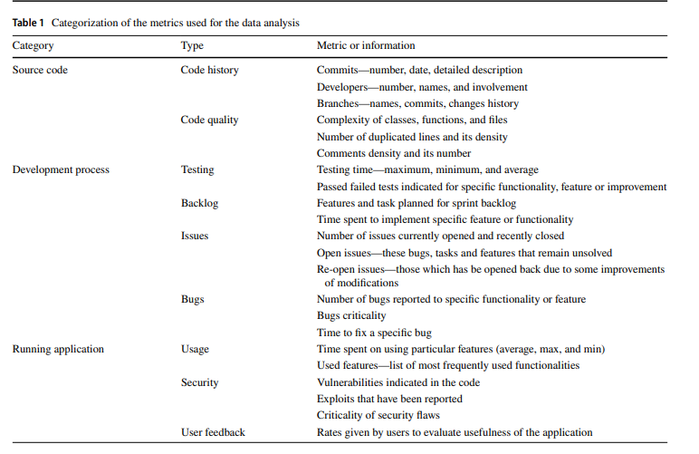

# Q-Rapids

O Q-Rapids (Quality-Aware Rapid Software Development) é um framework voltado para o apoio à tomada de decisão sobre qualidade em desenvolvimento ágil, baseado em evidências técnicas reais. A imagem abaixo mostra os dados brutos que esse framework utiliza para obter suas análises de dados.

<a id="fig2">**Figura 1 – Categorização das Métricas Usadas para Análise de Dados no Q-Rapids**</a>

<b>Autor: CHORAS, Michal. et al (2019)</b>

**Bibliografia**

> CHORAS, Michal. et al. Q-Rapids framework for advanced data analysis to improve rapid software development. Journal of Ambient Intelligence and Humanized Computing, v. 10, p. 1927–1936, 2019. Disponível em: https://doi.org/10.1007/s12652-018-0784-5. Acesso em: 25 jun. 2025. 
>

**Histórico de Versões**

| **Versão** | **Data**     | **Descrição**                     | **Autor**                                     |
|------------|--------------|-----------------------------------|-----------------------------------------------|
| `1.0`      | 25/06/2025   | Criação do documento  | [Victório Lázaro](https://github.com/Victor-oss) |